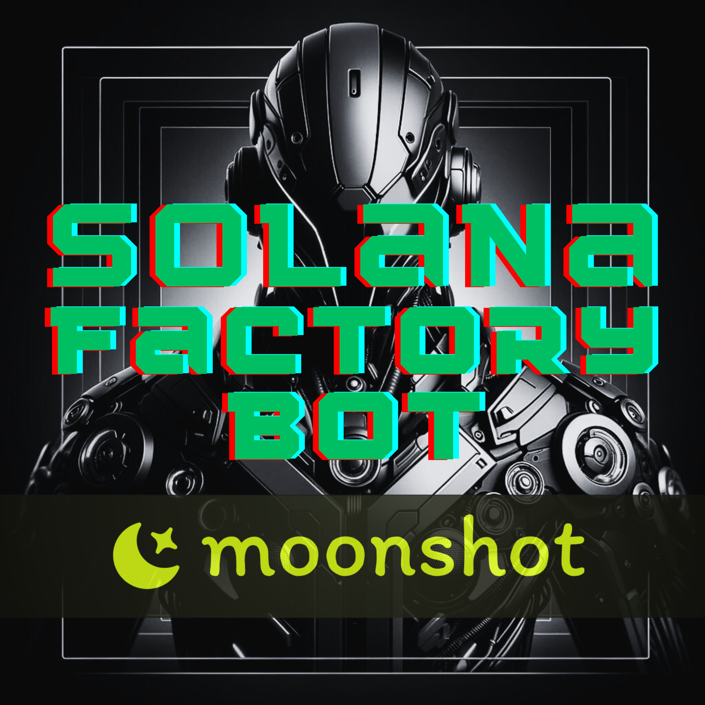

<h1  align="center"> Moonshot Sniper Bot 🌕 AIO Crypto Trading Bot </h1>
Moonshot sniper bot, Moonshot trading bot, trading bots, sniper bots, volume bots, Solana bot, Solana sniper bot, Solana volume bot, MEV attacks—our bot can replace all of these! by Sol|Factory 🏭

 

### ❔ What is Moonshot Sniper Bot❔

Moonshot Sniper Bot by Sol|Factory is a professional sniper bot designed to track new tokens on Moonshot and execute buy orders immediately according to your specified settings. It can also automatically sell tokens based on predefined conditions.

### ❔ What does Moonshot Sniper Bot do❔

Moonshot Sniper Bot allows you to be among the first to purchase new tokens on Moonshot. Additionally, it automates the selling process, allowing you to maximize your profits with minimal effort.

With this bot, you can set your own configurations, including your own RPC endpoints (You can also use our private RPCs ensuring a 100% success rate for all your transactions), buy/sell slippage, and selling strategies.

Additionally, you can view real-time logs of bot activity on your screen and filter them by detail, ensuring you have complete control and visibility over your transactions.

### 🔑 Key Features of Moonshot Sniper Bot:
- Automatically buy new tokens on Moonshot.
- View real-time logs of bot activity on your screen.
- Choose between different log levels for the output.
- Set your own **RPC** endpoints and commitment levels. **(our private RPC ensuring a 100% success rate for all your transactions)**
- Customize buying options with buy slippage and minimum buy supply percent.
- Customize selling options with sell slippage, buys before selling, and maximum sell supply percent.
- Save and load settings from your browser's local storage.
- Receive a link to Solscan and Dexscreener after a successful trade to view details.

### 💹 You can also use other features of our AIO bot Sol|Factory, such as:
- **Flexible Token Bundler**: Lets you launch tokens on PUMP.FUN and Raydium.
- **Sniper Protection**: The Bundler protects your tokens from snipers and optimizes performance.
- **Creates** natural trading activity for your token.
- Regularly moves your token to the main page of **PUMP.FUN|Moonshot.**
- Keeps your token at the top of charts on **GeckoTerminal** and **Dexscreener**.
- **PnL, Holding, Total Buy, Total Sold, Token Balance, Current Price, Market Cap, Pool.**
- **Transfer all tokens from Sub Wallets to Master Wallet for a big dump.**

### How much does Moonshot Sniper Bot cost? 💲

**Subscription: 10 SOL for a monthly subscription.**

**Trial Version: 30-minute trial available upon request via @SolFactory_bot.**

### ❗️How to get started with Moonshot Sniper Bot?❗️

We offer you to take a 30-minute test before buying, you can do this in the bot - @SolFactory_bot Just type TRIAL.
